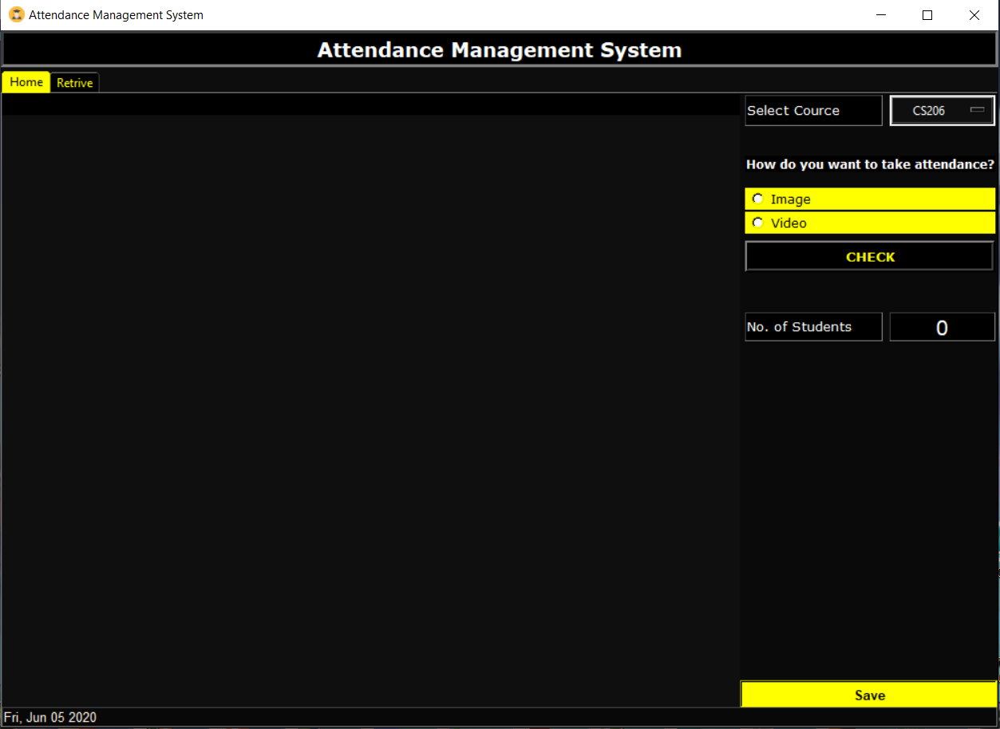
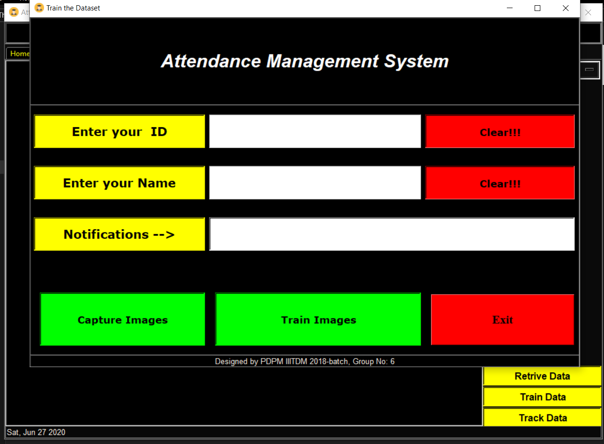

# Attendance Management system using Face👦 Recognition 
Attendance Management System by face recognition  using OpenCV

# Code Requirements
* Opencv
* Tkinter
* PIL  
* Firebase
* Dlib

# Screenshots

<table>

  <tr>
    <td valign="top"></td>
  
 </tr>
 
  <tr>
    <td valign="top"></td>
 

 </tr>
  <tr>
    <td valign="top"></td>
 

 </tr>
 <tr>
    <td valign="top"></td>
 

 </tr>
  
 </table>
 
